<!-- BANNER — ./profile.sh --live. Generated by scripts/banner/generate.py.
     To bust GitHub's image cache after regenerating: bump VERSION in generate.py and the paths below. -->
<picture>
  <source media="(prefers-color-scheme: dark)"  srcset="assets/banner-dark.v2.svg">
  <source media="(prefers-color-scheme: light)" srcset="assets/banner-light.v2.svg">
  
</picture>

 

<!-- NAME / TAGLINE — animated typing -->

 

---

## `> stack`

  

