<div align="center">

<!-- BANNER — ./profile.sh --live. Generated by scripts/banner/generate.py.
     To bust GitHub's image cache after regenerating: bump VERSION in generate.py and the paths below. -->
<picture>
  <source media="(prefers-color-scheme: dark)"  srcset="assets/banner-dark.v1.svg">
  <source media="(prefers-color-scheme: light)" srcset="assets/banner-light.v1.svg">
  
</picture>

<br>

<!-- NAME / TAGLINE — animated typing -->
<a href="https://bayartsetseg-portfolio.vercel.app/">
  
</a>

<br>

<!-- SOCIALS -->
<a href="https://bayartsetseg-portfolio.vercel.app/"></a>&nbsp;&nbsp;
<a href="mailto:bayartsetsegley@gmail.com"></a>&nbsp;&nbsp;
<a href="https://github.com/Bayartsetsegley01?tab=repositories"></a>&nbsp;&nbsp;


<br>


</div>

---

## `> whoami`

Hi, I'm **Bayartsetseg** (Баярцэцэг), a software developer from **Ulaanbaatar, Mongolia** 🇲🇳.
I care less about "my part" of the code and more about how the **whole system** fits together — UI, API, database, and the AI layer on top — and then I ship it.

- 🎓 **B.Sc. in Information Technology, MUST (ШУТИС)** · GPA 3.5 / 4.0 · ranked **5th of 80**
- 💳 **Building in FinTech** — loan admin systems, lending workflows with credit scoring, transaction APIs
- 🤖 **LLMs in real products** — personal AI insights with the Claude API, RAG, tool calling
- 🎨 **Designer who codes** — Google UX Design certified, UX/UI intern at Bimex Holding: I research, wireframe, *then* build
- 👩‍💻 **Community** — volunteer organizer at Women Techmakers Mongolia
- 📫 **Open to Software Engineer / Frontend roles** → [bayartsetsegley@gmail.com](mailto:bayartsetsegley@gmail.com)

```ts
const bayartsetseg = {
  base:       "Ulaanbaatar, Mongolia · UTC+8",
  role:       "Software Developer",
  focus:      ["Frontend", "Fullstack", "AI-powered apps"],
  building:   "NEYRA — AI vision board → daily action plan (React Native)",
  learning:   ["System design", "RAG & agents", "Spring Boot in depth"],
  superpower: "UX research → working, production-ready UI",
  lookingFor: "a team that ships real products",
};
```

<details>
<summary><b>🇲🇳 Монгол хэлээр</b></summary>

<br>

Шинэ зүйл сурч, сурсан мэдлэгээ хувийн төслүүддээ хэрэгжүүлэх замаар өөрийгөө хөгжүүлэх дуртай.
Веб болон мобайл хөгжүүлэлт хийхдээ зөвхөн нэг хэсэгт төвлөрөхөөс илүү систем бүхэлдээ хэрхэн ажилладгийг ойлгож, асуудлыг оновчтой шийдэхэд анхаардаг.

- 🎓 ШУТИС, МХТС — Мэдээллийн технологи · Голч 3.5/4.0 · 80 оюутнаас 5-рт
- 💳 FinTech чиглэлийн систем: зээлийн админ, зээлийн процесс, гүйлгээний API
- 🤖 AI технологийг (LLM API, RAG, tool calling) бодит төслүүддээ туршин хэрэгжүүлдэг
- 🎯 Зорилго: асуудлыг оновчтой шийдэж чаддаг **Software Engineer** болох
- 📫 Ажил, дадлага, төслийн санал → [bayartsetsegley@gmail.com](mailto:bayartsetsegley@gmail.com)

</details>

<br>

<div align="center">

## `> stack`


<br><br>


</div>

---

<div align="center">

## `> featured.work`

<!-- Cards are generated by scripts/cards.py from assets/projects.json -->

<a href="https://finloan-admin.vercel.app/"><picture><source media="(prefers-color-scheme: dark)"  srcset="assets/card-project-finloan-admin-dark.svg"><source media="(prefers-color-scheme: light)" srcset="assets/card-project-finloan-admin-light.svg">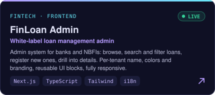</picture></a>
<a href="https://tradejournal101-frontend.onrender.com/"><picture><source media="(prefers-color-scheme: dark)"  srcset="assets/card-project-tradejournal-dark.svg"><source media="(prefers-color-scheme: light)" srcset="assets/card-project-tradejournal-light.svg">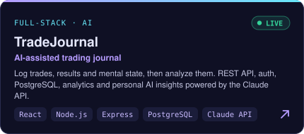</picture></a>
<a href="https://github.com/Bayartsetsegley01/lendflow-api"><picture><source media="(prefers-color-scheme: dark)"  srcset="assets/card-project-lendflow-lite-dark.svg"><source media="(prefers-color-scheme: light)" srcset="assets/card-project-lendflow-lite-light.svg">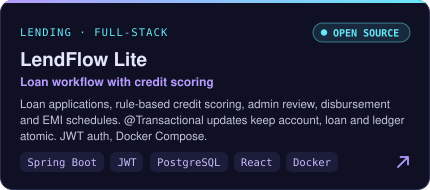</picture></a>
<a href="https://bayartsetseg-portfolio.vercel.app/"><picture><source media="(prefers-color-scheme: dark)"  srcset="assets/card-project-neyra-dark.svg"><source media="(prefers-color-scheme: light)" srcset="assets/card-project-neyra-light.svg">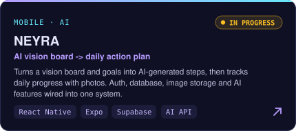</picture></a>
<a href="https://github.com/Bayartsetsegley01/fintech-api"><picture><source media="(prefers-color-scheme: dark)"  srcset="assets/card-project-fintech-transaction-api-dark.svg"><source media="(prefers-color-scheme: light)" srcset="assets/card-project-fintech-transaction-api-light.svg">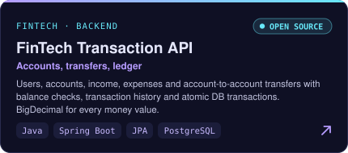</picture></a>
<a href="https://github.com/Bayartsetsegley01/fintech-dashboard"><picture><source media="(prefers-color-scheme: dark)"  srcset="assets/card-project-fintech-dashboard-dark.svg"><source media="(prefers-color-scheme: light)" srcset="assets/card-project-fintech-dashboard-light.svg">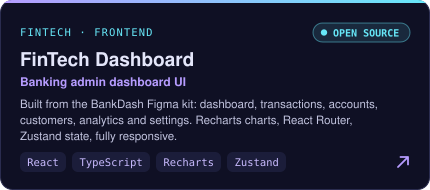</picture></a>

<sub>Click a card to open the live demo or repository · more on my <a href="https://bayartsetseg-portfolio.vercel.app/">portfolio</a></sub>

</div>

---

<div align="center">

## `> signals`

<table>
<tr>
<td width="50%" align="center" valign="middle">

<!-- Self-rated skill radar — edit assets/skills.json, the workflow redraws it -->
<picture>
  <source media="(prefers-color-scheme: dark)"  srcset="assets/radar-dark.svg">
  <source media="(prefers-color-scheme: light)" srcset="assets/radar-light.svg">
  
</picture>

</td>
<td width="50%" align="center" valign="middle">

<!-- Language radar — edit assets/langmix.json -->
<picture>
  <source media="(prefers-color-scheme: dark)"  srcset="assets/radar-langs-dark.svg">
  <source media="(prefers-color-scheme: light)" srcset="assets/radar-langs-light.svg">
  
</picture>

</td>
</tr>
</table>

</div>

---

<div align="center">

## `> journey`

<!-- Animated timeline — edit assets/journey.json, the workflow redraws it -->
<picture>
  <source media="(prefers-color-scheme: dark)"  srcset="assets/journey-dark.svg">
  <source media="(prefers-color-scheme: light)" srcset="assets/journey-light.svg">
  
</picture>

<br><br>


</div>

---

<div align="center">

## `> numbers`

<!-- Self-hosted cards (scripts/cards.py). Deliberately NOT github-readme-stats:
     shared public instances go down and take the whole section with them. -->
<picture>
  <source media="(prefers-color-scheme: dark)"  srcset="assets/card-stats-dark.svg">
  <source media="(prefers-color-scheme: light)" srcset="assets/card-stats-light.svg">
  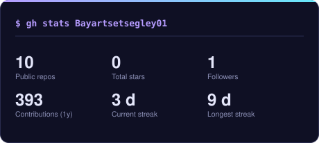
</picture>
<picture>
  <source media="(prefers-color-scheme: dark)"  srcset="assets/card-langs-dark.svg">
  <source media="(prefers-color-scheme: light)" srcset="assets/card-langs-light.svg">
  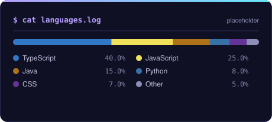
</picture>

</div>

---

<div align="center">

<sub>`built with Python · SVG · GitHub Actions — © 2026 Bayartsetseg Tsogtbaatar`</sub>

</div>
